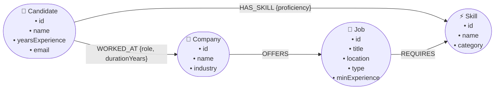

# CognoMatch: Graph-Powered Candidate–Job Skill Matching Application

An intelligent, real-time candidate-to-job recommendation system built with **FastAPI**, **CognoDB Cloud / Neo4j**, **openCypher**, and a modern, responsive web frontend.

---

## 1. Project Title & Overview

**CognoMatch** is a full-stack job recommendation engine designed for recruitment platforms. Leveraging graph database traversal mechanics (Index-Free Adjacency) instead of expensive relational SQL `JOIN` operations, CognoMatch matches job seekers to job openings based on shared skill graphs, computes match percentages, highlights verified skill overlaps, and surfaces skill gaps in real time.

---

## 2. Problem Being Solved

Traditional recruitment platforms often rely on relational databases or basic keyword matching. As the number of candidates, skills, certifications, job requirements, and past employers grows:
- **Relational JOIN Explosion**: Calculating skill overlaps across $N$ candidates and $M$ jobs requires multiple large table joins (`Candidates`, `CandidateSkills`, `Skills`, `JobSkills`, `Jobs`), resulting in high latency and complex queries.
- **Lack of Multi-Hop Context**: Relational schemas struggle to easily query indirect connections (e.g. *“Find jobs requiring skills possessed by candidates who previously worked at fintech companies”*).
- **Rigid Matching**: Keyword search fails to capture semantic relationships and structural graph distance.

**CognoMatch** solves this by modeling Candidates, Jobs, Skills, and Companies as a native property graph, making skill matching an intuitive, sub-millisecond multi-hop traversal.

---

## 3. Key Features

- **Native Multi-Hop Graph Traversal**: Direct traversal along `Candidate -[:HAS_SKILL]-> Skill <-[:REQUIRES]- Job`.
- **Accurate Real-Time Compatibility Scoring**: Calculates matching skill count, total required skills, and dynamic match percentage:
  $$\text{Match Percentage} = \text{round}\left(100.0 \times \frac{\text{matching skills count}}{\text{required skills count}}, 2\right)$$
- **Skill Gap Analysis**: Surfaces both **Matched Skills** (green badges) and **Missing Skills** (neutral badges) for each job.
- **Interactive Modern Frontend**:
  - Quick-select candidate dropdown with pre-populated experience & skills previews.
  - Manual Candidate ID search with instant validation.
  - Dynamic score filtering (All Matches, 75%+ Match, 50%+ Match).
  - Visual match score indicators (emerald/amber/slate) and progress bars.
  - Comprehensive UI states: Loading skeletons, empty states, and dismissible error alerts.
- **Enterprise-Grade FastAPI Backend**:
  - Strictly parameterized openCypher queries preventing injection vulnerabilities.
  - Multi-tier error handling (400 Bad Request, 404 Not Found, 503 Service Unavailable).
  - CORS-enabled for seamless frontend and API client integration.
  - Automatic `.env` multi-path discovery supporting both `COGNODB_*` and `NEO4J_*` credentials.
- **Automated Test Suite**: 100% passing `pytest` test suite verifying endpoints, ranking logic, and error handling.

---

## 4. Technology Stack

| Layer | Technology | Purpose |
|---|---|---|
| **Database** | CognoDB Cloud / Neo4j 5+ | Native graph database storing nodes and relationships |
| **Query Language** | openCypher | Declarative graph pattern matching |
| **Backend Framework** | FastAPI (Python 3.12+) | High-performance asynchronous REST API |
| **Database Driver** | `neo4j` official Python Driver | Thread-safe connection pooling and session management |
| **Environment Config** | `python-dotenv` | Secure credential injection without hardcoding |
| **Frontend UI** | HTML5, Modern CSS3, Vanilla ES6 JavaScript | Zero-dependency, responsive interface with glassmorphism |
| **Testing** | `pytest`, `httpx`, `fastapi.testclient` | Automated integration and unit testing |

---

## 5. Why a Graph Database?

Graph databases are purpose-built for highly connected domain data such as talent-job matching:

1. **Index-Free Adjacency**: Each candidate and job node directly points to its adjacent skill nodes. Traversals operate in $O(k)$ time (proportional to the number of connections) rather than $O(N \log M)$ relational index lookups.
2. **Multi-Hop Traversal Without JOINs**:
   $$\text{Candidate} \xrightarrow{\text{HAS\_SKILL}} \text{Skill} \xleftarrow{\text{REQUIRES}} \text{Job} \xleftarrow{\text{OFFERS}} \text{Company}$$
   Writing this in Cypher requires a single readable pattern without joining 4 intermediate mapping tables.
3. **Flexible Schema Evolution**: New node types (e.g. `Project`, `Degree`, `Location`) and relationship properties (e.g. `proficiency: 'Expert'`, `yearsOfExperience: 3`) can be added without database migrations or breaking existing queries.

---

## 6. Graph Data Model & Schema

### Mermaid Diagram



### ASCII Graph Representation

```
 (Candidate: John Smith)
     │
     ├─── [:HAS_SKILL {proficiency: 'Expert'}] ───► (Skill: Python) ◄─── [:REQUIRES] ─── (Job: Backend Engineer)
     │                                                                                           ▲
     ├─── [:WORKED_AT {role: 'SWE'}] ───► (Company: CloudScale) ───────── [:OFFERS] ────────────┘
```

---

## 7. Node Types & Properties

| Label | Key Properties | Example |
|---|---|---|
| **`Candidate`** | `id` (string), `name` (string), `yearsExperience` (int), `email` (string) | `{id: 'C001', name: 'John Smith', yearsExperience: 5}` |
| **`Job`** | `id` (string), `title` (string), `location` (string), `type` (string), `minExperience` (int) | `{id: 'J001', title: 'Python Backend Engineer', location: 'Bangalore'}` |
| **`Skill`** | `id` (string), `name` (string), `category` (string) | `{id: 'S001', name: 'Python', category: 'Backend'}` |
| **`Company`** | `id` (string), `name` (string), `industry` (string) | `{id: 'COMP001', name: 'CloudScale Technologies', industry: 'Enterprise Software'}` |

---

## 8. Relationship Types & Properties

| Relationship | Source Node | Target Node | Properties | Semantics |
|---|---|---|---|---|
| **`HAS_SKILL`** | `Candidate` | `Skill` | `proficiency` (e.g. `'Expert'`) | Candidate possesses skill |
| **`REQUIRES`** | `Job` | `Skill` | None | Job requires skill |
| **`OFFERS`** | `Company` | `Job` | None | Company has opened job position |
| **`WORKED_AT`** | `Candidate` | `Company` | `role` (string), `durationYears` (int) | Candidate previous employment history |

---

## 9. Matching Algorithm Explanation

The recommendation query works in 4 logical stages:

1. **Candidate Traversal**: Identify all skills linked to the candidate:
   `(c:Candidate {id: $candidateId})-[:HAS_SKILL]->(s:Skill)`
2. **Multi-Hop Job Discovery**: Traverse from those skills to any job requiring them:
   `(s:Skill)<-[:REQUIRES]-(j:Job)`
3. **Skill Aggregation & Gap Calculation**:
   - Collect matching skills: `collect(DISTINCT s.name) AS matchingSkills`
   - Count matching skills: `count(DISTINCT s) AS matchCount`
   - Count total required skills for each matched job: `count(DISTINCT required) AS requiredSkillCount`
   - Determine missing skills: `[skill IN allRequiredSkills WHERE NOT skill IN matchingSkills] AS missingSkills`
4. **Scoring & Sorting**:
   - Compute match percentage: `round(100.0 * matchCount / requiredSkillCount, 2)`
   - Order descending by `matchPercentage`, then `matchCount`, then `job.title`.

---

## 10. Main Cypher Queries (Annotated)

### 1. Multi-Hop Candidate-to-Job Matching & Ranking
```cypher
MATCH (c:Candidate {id: $candidateId})
      -[:HAS_SKILL]->(s:Skill)
      <-[:REQUIRES]-(j:Job)

WITH
    j,
    collect(DISTINCT s.name) AS matchingSkills,
    count(DISTINCT s) AS matchCount

MATCH (j)-[:REQUIRES]->(required:Skill)
OPTIONAL MATCH (co:Company)-[:OFFERS]->(j)

WITH
    j,
    co,
    matchingSkills,
    matchCount,
    collect(DISTINCT required.name) AS allRequiredSkills,
    count(DISTINCT required) AS requiredSkillCount

RETURN
    j.id AS jobId,
    j.title AS title,
    j.location AS location,
    j.type AS type,
    co.name AS company,
    matchingSkills,
    matchCount,
    requiredSkillCount,
    [skill IN allRequiredSkills WHERE NOT skill IN matchingSkills] AS missingSkills,
    (100.0 * matchCount / requiredSkillCount) AS matchPercentage

ORDER BY matchPercentage DESC, matchCount DESC, j.title ASC
```

### 2. Candidate Profile & Verified Skills
```cypher
MATCH (c:Candidate {id: $candidateId})
OPTIONAL MATCH (c)-[:HAS_SKILL]->(s:Skill)
OPTIONAL MATCH (c)-[:WORKED_AT]->(co:Company)
RETURN
    c.id AS id,
    c.name AS name,
    c.yearsExperience AS yearsExperience,
    c.email AS email,
    collect(DISTINCT s.name) AS skills,
    collect(DISTINCT co.name) AS previousCompanies
```

### 3. Job Listing with Requirements & Company
```cypher
MATCH (j:Job)
OPTIONAL MATCH (j)-[:REQUIRES]->(s:Skill)
OPTIONAL MATCH (co:Company)-[:OFFERS]->(j)
RETURN
    j.id AS id,
    j.title AS title,
    j.location AS location,
    j.type AS type,
    j.minExperience AS minExperience,
    co.name AS company,
    collect(DISTINCT s.name) AS requiredSkills
ORDER BY j.id
```

---

## 11. Project Structure

```
cognodb_job/
├── backend/
│   ├── app/
│   │   ├── database/
│   │   │   ├── __init__.py
│   │   │   └── connection.py          # Driver management & session context manager
│   │   ├── queries/
│   │   │   ├── __init__.py
│   │   │   └── job_queries.py         # Parameterized openCypher queries
│   │   ├── services/
│   │   │   ├── __init__.py
│   │   │   └── matching_service.py    # Business logic, validation & scoring
│   │   ├── main.py                    # FastAPI application, CORS & error handlers
│   │   └── test_connection.py         # Quick connection verification script
│   │
│   ├── seed/
│   │   └── seed.py                    # Graph database seeding script
│   │
│   ├── tests/
│   │   ├── __init__.py
│   │   ├── test_api.py                # REST endpoint integration tests
│   │   └── test_matching_logic.py     # Math & graph matching unit tests
│   │
│   ├── .env                           # Local environment variables (git-ignored)
│   ├── .env.example                   # Template with placeholders
│   ├── .gitignore                     # Git ignore rules
│   └── requirements.txt               # Backend dependencies
│
├── frontend/
│   ├── index.html                     # Semantic accessible web UI
│   ├── style.css                      # Modern glassmorphic dark design system
│   └── script.js                      # API client, metrics & responsive state management
│
├── .env                               # Root environment file (git-ignored)
├── .env.example                       # Root template
├── .gitignore                         # Root git ignore
├── requirements.txt                   # Root requirements
├── requirement.md                     # Assignment requirements specification
└── README.md                          # Comprehensive project documentation
```

---

## 12. CognoDB / Neo4j Setup

1. Create a graph database instance on [CognoDB Cloud](https://cognodb.cloud) or Neo4j AuraDB.
2. Note your connection URI (`bolt+s://...`), username, and password.
3. Verify that IP access / network access is allowed for your client machine.

---

## 13. Environment Variables

Create a `.env` file in the project root or in `backend/.env`:

```env
# CognoDB / Neo4j Connection Credentials
COGNODB_URI=bolt+s://your-instance.databases.cognodb.cloud
COGNODB_USERNAME=cognodb
COGNODB_PASSWORD=your_secure_password_here

# Alternative variable names also supported
NEO4J_URI=bolt+s://your-instance.databases.cognodb.cloud
NEO4J_USER=cognodb
NEO4J_PASSWORD=your_secure_password_here

# Server Configuration
PORT=8000
HOST=0.0.0.0
```

> [!CAUTION]
> Never commit `.env` containing live credentials to version control. The repository `.gitignore` automatically excludes all `.env` files.

---

## 14. Installation Guide

### Prerequisites
- Python 3.10+ (Python 3.12 recommended)
- `pip` package manager

### Steps

1. **Clone the repository:**
   ```bash
   git clone <repository-url>
   cd cognodb_job
   ```

2. **Create and activate a virtual environment:**
   ```bash
   # Windows (PowerShell)
   python -m venv venv
   .\venv\Scripts\Activate.ps1

   # Linux / macOS
   python3 -m venv venv
   source venv/bin/activate
   ```

3. **Install dependencies:**
   ```bash
   pip install -r requirements.txt
   ```

4. **Verify Database Connection:**
   ```bash
   python backend/app/test_connection.py
   ```
   *Expected Output:* `CognoDB connection successful! Query result: 1`

---

## 15. Database Seeding Instructions

To populate your CognoDB database with realistic Candidates, Skills, Jobs, Companies, and Relationships:

```bash
python backend/seed/seed.py
```

*Output:*
```text
Clearing existing graph data...
Creating Candidate nodes...
Creating Skill nodes...
Creating Job nodes...
Creating Company nodes...
Creating Candidate -> HAS_SKILL -> Skill relationships...
Creating Job -> REQUIRES -> Skill relationships...
Creating Company -> OFFERS -> Job relationships...
Creating Candidate -> WORKED_AT -> Company relationships...
Database seeded successfully with rich sample graph data!
```

---

## 16. Running the FastAPI Backend

Start the FastAPI application with Uvicorn:

```bash
# From the project root:
uvicorn backend.app.main:app --reload --port 8000

# Or from within the backend/ directory:
cd backend
uvicorn app.main:app --reload --port 8000
```

The API will be available at:
- **API Base URL**: `http://127.0.0.1:8000`
- **Interactive Swagger Docs**: `http://127.0.0.1:8000/docs`
- **ReDoc Documentation**: `http://127.0.0.1:8000/redoc`

---

## 17. Running the Frontend

The frontend is built with vanilla HTML/CSS/JavaScript and can be served with any static server:

```bash
# Using Python's built-in HTTP server:
python -m http.server 3000 --directory frontend
```

Open your browser and navigate to:
`http://127.0.0.1:3000`

---

## 18. API Endpoints Reference

### 1. `GET /`
- **Description**: Service health and endpoint directory.
- **Response `200 OK`**:
  ```json
  {
    "status": "online",
    "service": "CognoDB Job Recommendation API",
    "version": "1.0.0",
    "endpoints": { ... }
  }
  ```

### 2. `GET /health` or `GET /database-test`
- **Description**: Validates live CognoDB / Neo4j database connectivity.
- **Response `200 OK`**:
  ```json
  {
    "status": "healthy",
    "database": "connected",
    "result": 1
  }
  ```

### 3. `GET /candidates`
- **Description**: Returns all candidates with verified skills.
- **Response `200 OK`**:
  ```json
  [
    {
      "id": "C001",
      "name": "John Smith",
      "yearsExperience": 5,
      "email": "john.smith@example.com",
      "skills": ["Docker", "FastAPI", "Python", "React", "SQL"]
    }
  ]
  ```

### 4. `GET /candidates/{candidate_id}`
- **Description**: Returns details for a specific candidate.
- **Errors**: `404 Not Found` if candidate does not exist.

### 5. `GET /match/{candidate_id}`
- **Description**: Returns jobs ranked by match percentage for the given candidate.
- **Alias**: `GET /candidates/{candidate_id}/recommendations`
- **Response `200 OK`**:
  ```json
  [
    {
      "jobId": "J001",
      "title": "Python Backend Engineer",
      "location": "Bangalore",
      "type": "Full-time",
      "company": "CloudScale Technologies",
      "matchingSkills": ["Docker", "FastAPI", "Python", "SQL"],
      "matchCount": 4,
      "requiredSkillCount": 4,
      "missingSkills": [],
      "matchPercentage": 100.0
    },
    {
      "jobId": "J005",
      "title": "Cloud Data Engineer",
      "location": "Bangalore",
      "type": "Full-time",
      "company": "Innovate AI Labs",
      "matchingSkills": ["Python", "SQL"],
      "matchCount": 2,
      "requiredSkillCount": 3,
      "missingSkills": ["AWS"],
      "matchPercentage": 66.67
    }
  ]
  ```
- **Response `404 Not Found`** (e.g. `GET /match/C999`):
  ```json
  {
    "detail": "Candidate 'C999' not found."
  }
  ```

### 6. `GET /jobs`
- **Description**: Returns all job openings with required skills.

### 7. `GET /skills`
- **Description**: Returns all unique skill nodes in the graph.

---

## 19. Error Handling Architecture

The application implements defense-in-depth error handling:
- **No Sensitive Information Leaked**: Database passwords, connection strings, and raw stack traces are never exposed in JSON responses.
- **Safe Database Status**: If CognoDB is unreachable, the API returns a graceful `503 Service Unavailable` with `{"detail": "CognoDB/Neo4j database service is currently unavailable."}` without crashing the FastAPI process.
- **Candidate Validation**: Missing IDs return `400 Bad Request`; non-existent IDs return `404 Not Found`.

---

## 20. Testing Guide

The project includes an automated test suite with **21 comprehensive test cases**:

```bash
pytest backend/tests -v
```

### Test Coverage Summary (21 Tests):
- `test_root_endpoint`: Verifies API metadata, service name, and online status.
- `test_health_check_endpoint`: Tests live DB connection health and connectivity indicator.
- `test_database_test_endpoint`: Validates `/database-test` alias health check.
- `test_get_candidates`: Validates candidates list format, schema, and properties.
- `test_get_candidate_by_id_success` & `_not_found`: Validates 200 OK vs 404 Not Found responses.
- `test_get_candidate_skills` & `_not_found`: Validates skill relationship retrieval and 404 handling.
- `test_get_jobs` & `test_get_job_by_id_success` & `_not_found`: Validates job and company lookups with 200/404.
- `test_get_skills`: Validates global skill catalog.
- `test_matching_endpoint_success`: Validates ranked multi-hop job recommendations.
- `test_matching_endpoint_candidate_not_found`: Validates 404 behavior for unknown candidate IDs.
- `test_matching_alias_endpoint`: Verifies route parity between `/match/{id}` and `/candidates/{id}/recommendations`.
- `test_cors_headers_present`: Verifies CORS origin reflection and headers for web clients.
- `test_matching_percentage_calculation`: Validates matching mathematics: $100.0 \times \frac{\text{matchCount}}{\text{requiredSkillCount}}$.
- `test_matching_skill_containment`: Verifies matched skills belong to the candidate.
- `test_missing_skills_accuracy`: Validates missing skills correctly represent the candidate skill gap without false overlap.
- `test_ranking_order`: Confirms results are sorted strictly in descending order of match percentage.
- `test_empty_candidate_id_raises_http_400`: Validates input validation returning 400 Bad Request for empty/whitespace input.

---

## 21. Screenshots & UI Walkthrough

### 1. Real-Time Job Matching

*Displays candidate profile card with verified skill chips, summary metrics bar, and ranked job cards with match percentages and skill gap tags.*

### 2. Candidate Selection & Filtering

*Dynamic dropdown selection, instant ID input binding, and score threshold filtering (75%+, 50%+).*

---

## 22. Production & Deployment Readiness

### Production Checklist
- [x] Environment variable isolation with `.env` / `.env.example`
- [x] Connection pooling with driver lifecycle management
- [x] Parameterized Cypher queries preventing Cypher-injection attacks
- [x] CORS security configured for production origin restrictions
- [x] Global exception handlers capturing database outages
- [x] Dockerfile / Container ready

### Containerization (Optional Dockerfile)
```dockerfile
FROM python:3.12-slim
WORKDIR /app
COPY requirements.txt .
RUN pip install --no-cache-dir -r requirements.txt
COPY . .
EXPOSE 8000
CMD ["uvicorn", "backend.app.main:app", "--host", "0.0.0.0", "--port", "8000"]
```

---

## 23. Author & License

- **Developer**: Lead Developer Submission for Wexa AI Take-Home Assignment
- **License**: MIT
